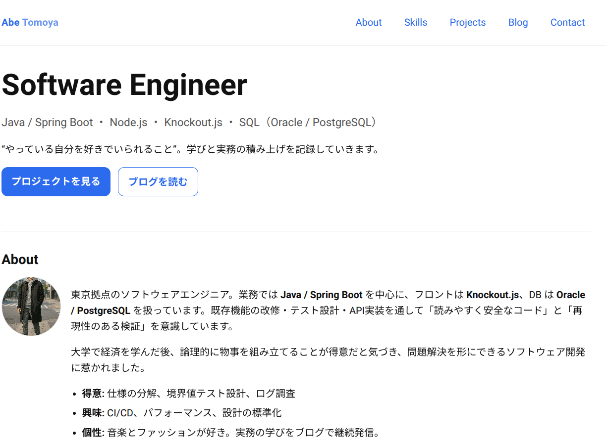

# SE Portfolio Starter (静的サイト)


名刺代わりのシンプルなポートフォリオ＋最小ブログ。HTML/CSS/JSのみ。

---

## スクリーンショット


---# Abe Tomoya Portfolio

[](https://tomoya-1124.github.io/)

このリポジトリは Abe Tomoya のポートフォリオサイトです。  
**GitHub Pages** を利用して公開しています。

---

## 🔗 公開URL
- https://tomoya-1124.github.io/

---

## 📝 サイト概要
- 名刺代わりのポートフォリオ＋ブログ
- **使用技術**：HTML / CSS / JavaScript / GitHub Pages
- **主なコンテンツ**：
  - プロフィール（About）
  - プロジェクト（Projects）
  - ブログ（Blog）

---

## 📰 ブログ記事（例）
- [GitHub Pagesでポートフォリオ公開！詰まったところと学び](https://tomoya-1124.github.io/posts/first-post.html)
- [SSH鍵とpushの詰まりを一気に解消するメモ](https://tomoya-1124.github.io/posts/ssh-troubleshoot.html)
- [なぜポートフォリオにブログを足したのか](https://tomoya-1124.github.io/posts/why-add-blog.html)

---

## 💡 今後の予定
- Knockout.js や Spring Boot の学習記事を追加
- 技術以外にファッションや音楽の話も投稿
- デザイン・アクセシビリティの改善

---

## 🛠 セットアップ
このサイトは静的HTMLで構成されており、特別なビルド手順はありません。  
以下の手順でローカルでも表示可能です：

```bash
git clone git@github.com:tomoya-1124/tomoya-1124.github.io.git
cd tomoya-1124.github.io
open index.html   # またはブラウザで開く
